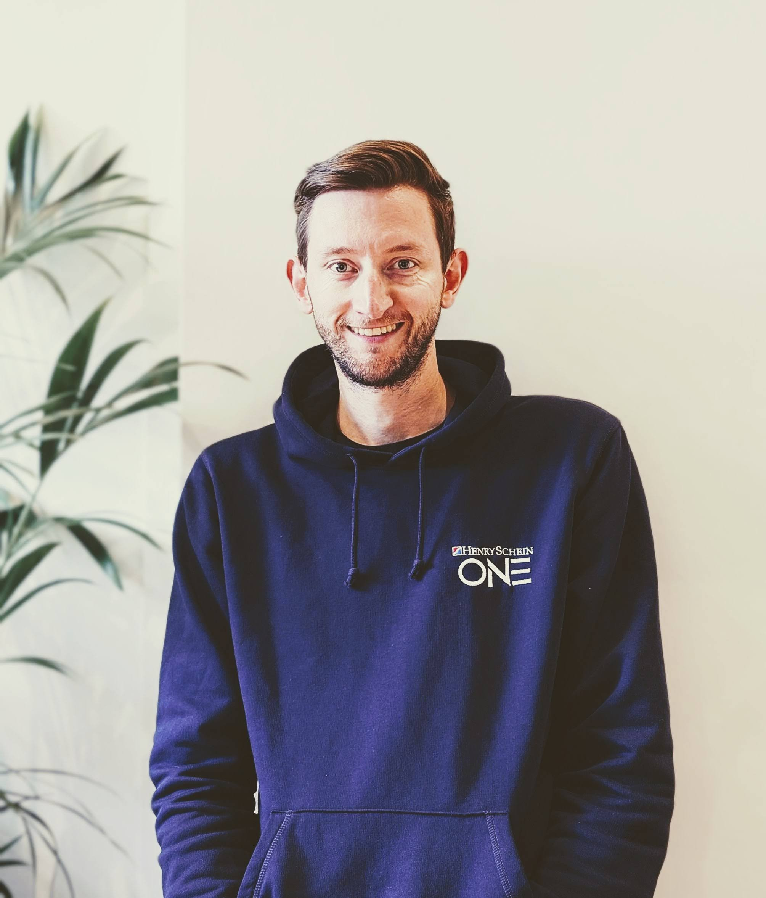

  

## Skills
Python  
SQL  
Pizza making  
Pizza eating  

## Data Projects  

  

    <h4>Chasing Speed: Why Non-Elite Marathon Times Remain Stagnant Despite Running Tech Advancements</h4>
    

    

  

  

## Education
Data Science (Work based apprenticeship with [BPP](https://www.bpp.com/) - May 2023 - May 2026

## Work Experience
[Henry Schein One UK](https://www.linkedin.com/company/henry-schein-one-uk/posts/?feedView=all)  
Systems Engineer - May 2023 - Present  
Software Innovation Analyst - August 2020 - May 2023  
Senior Software Support Technician Oct 2014 - August 2020  

